## 🛠️ Tech Stack & Skills

### 🌐 Frontend Development

  

  <b>HTML5</b> • <b>CSS3</b> • <b>JavaScript</b>

  Responsive Design • UI Development • User-Friendly Interfaces

---

### ☕ Programming

  

  <b>Java</b> • Core Java • OOP • Problem Solving

---

### 🔧 Tools & Version Control

  

  <b>Git</b> • <b>GitHub</b> • <b>VS Code</b>

---

### 🚀 Currently Building

  💻 Responsive Web Projects &nbsp; • &nbsp;
  ☕ Java Projects &nbsp; • &nbsp;
  🚀 Full-Stack Learning

### 📚 Currently Learning

`JavaScript` &nbsp; `Java` &nbsp; `Web Development` &nbsp; `Git & GitHub`

### 🎯 Goals

  <b>Build Real-World Projects • Improve Coding Skills • Learn New Technologies • Contribute to Open Source</b>

